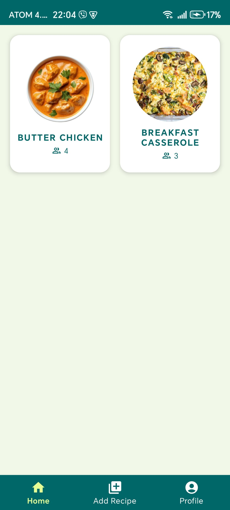
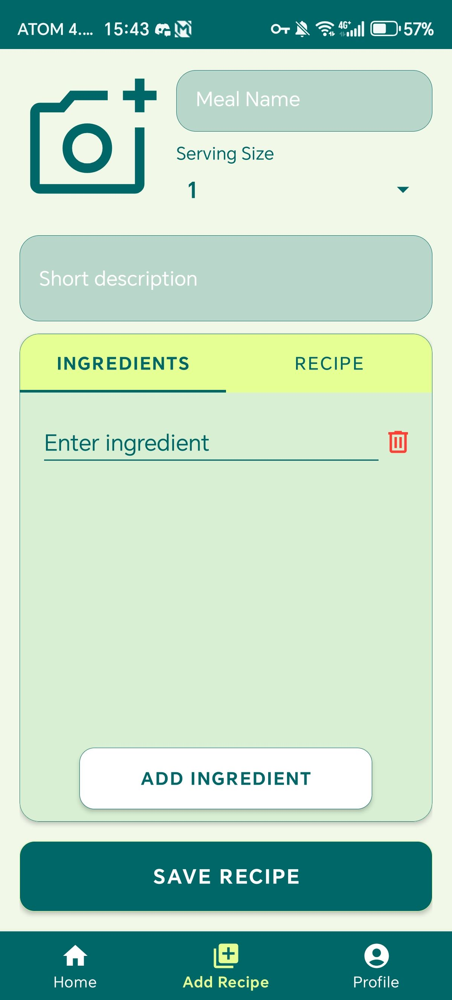
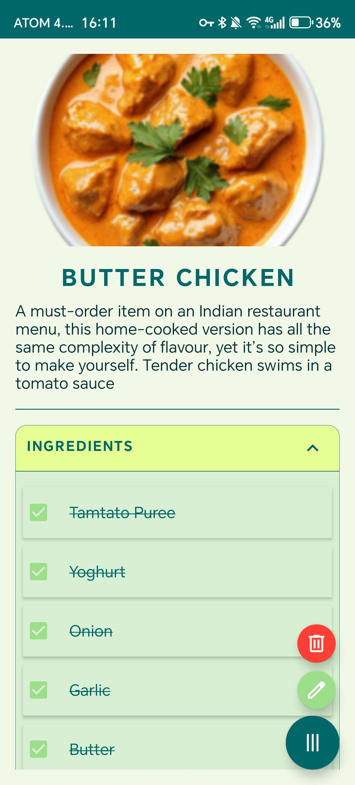
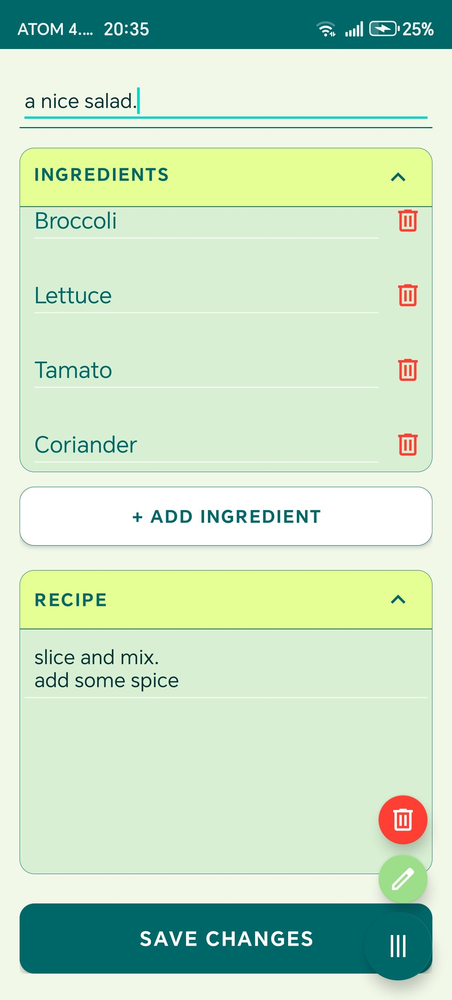

# Recipe Mobile App (Mealmate)

  

MealMate is a mobile recipe management application developed using **Native Android (Java)**.  
The app allows users to create, store, and manage their own meal recipes with an intuitive and interactive mobile interface.

This project focuses on **modern mobile UI design, gesture-based interactions, and cloud-based storage using Firebase**.

---

## Overview

MealMate allows users to maintain a personal collection of recipes directly from their mobile device.  
Users can create recipes, view their saved meals, and manage them through an intuitive gesture-based interface.

Each user can create an account and store their own recipes securely. The application ensures that users only see and manage **their own personal recipe collection**.

---

## Features

- User authentication with Firebase
- Add custom recipes with ingredients and instructions
- View and manage saved recipes
- Personal recipe storage (each user sees only their own data)
- Smooth navigation using swipe gestures
- Tab-based interface for organized navigation
- Gesture-based controls for faster interaction
- Shake gesture to delete recipes
- Clean and modern mobile UI design

---

## Technologies Used

- **Java (Native Android Development)**
- **Android SDK**
- **Firebase Authentication**
- **Firebase Firestore / Database**
- **Gesture Detection APIs**

---

## Key Learning Objectives

This project demonstrates:

- Native Android mobile application development
- Interactive mobile UI design
- Gesture-based user interactions
- Firebase authentication and cloud data storage
- User-based data management

---

## Screenshots

  
  
  
  

More screenshots available here:

[View all screenshots](screenshots/)

---

## Author

**Saw Thu Rein Htay**  
Software Developer | Mobile & Web Development  

Email: thureinrichard3@gmail.com

---

## Future Improvements

- Recipe sharing between users
- Image upload for recipes
- Favorite recipes system
- Recipe search and filtering
- Cloud synchronization improvements
